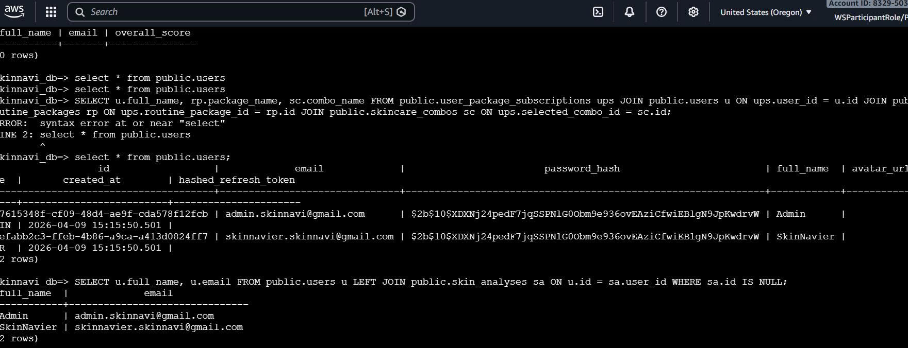

#### 1. COVER

## Group Information
- Group number: 15
- Members:
  - Phạm Vũ Khánh Trường
  - Ka Phu Đông
  - Nguyễn Thị Tiểu Phương
  - Văn Phú Tín 
  - Phan Văn Duy 
  - Hà Tây Nguyên 
  - Nguyễn Đình Thi
  - Võ Lê Trường Huy 
  - Châu Thành Trung 

## Database Choice
- Selected DB engine: RDS Postgre SQL
- Reason: We chose PostgreSQL because the data involves complex relationships and requires strong data integrity and ACID transactions, especially for the payment workflow. In addition, PostgreSQL works well with Prisma, making the implementation more convenient and stable.

#### 2. DATA ACCESS PATTERN LOG (A, B, C)

## Pattern A: User Skin Analysis & Routine Access

- Description: Users frequently access skin analysis results, skin metrics, and personalized daily skincare routines.
- Access type: Read (Primary) + Write (when new analysis is created)
- Frequency: High
- Chosen engine: RDS PostgreSQL
- Reason:
  - Data is highly relational (users → skin_analysis → routine_steps).
  - Requires JOIN queries and strong consistency.
  - ACID compliance is needed to ensure correct personalized results.

## Pattern B: Subscription & Payment Transactions

- Description: Users purchase skincare packages and manage subscriptions with payment processing.
- Access type: Write + Read
- Frequency: Medium
- Chosen engine: RDS PostgreSQL
- Reason:
  - Requires transactional integrity (payment must be consistent).
  - Includes relational data (users, packages, subscriptions, payments).
  - Supports rollback in case of payment failure (ACID compliance).

## Trade-offs

- Cost: RDS is more expensive but required for relational and transactional data. DynamoDB is cost-efficient for high-volume logs.
- Performance: RDS performs well for JOIN and structured queries but is slower for high-frequency event logging.
- Scalability: DynamoDB scales horizontally for event data, while RDS scales vertically and via replicas.
- HA / Backup: RDS provides Multi-AZ deployment and automated backups, ensuring high availability and data durability.

#### 3. DEPLOYMENT EVIDENCE

## 3.1 Encryption
Screenshot: RDS

- Explanation:
  + RDS PostgreSQL is successfully deployed and running.
  + Storage encryption is enabled using AWS KMS to secure data at rest.
  + Public access is disabled to prevent exposure to the internet.
  + Database is deployed inside a private subnet group for security isolation.

## 3.2 Security Group
- Screenshot:

- Explanation:
  + Database is only accessible from trusted application security groups.
  + Direct internet access is blocked for security.
  + This enforces network-level isolation between app and database tiers.

#### 4. WORKING QUERY EVIDENCE
## JOIN Query Test (Relational DB)
- Screenshot:

- Explanation: The queries demonstrate that the PostgreSQL RDS database is working correctly and contains real data.
  + The SELECT query confirms that the `users` table is accessible and returns existing records.
  + The JOIN query shows correct relationships between multiple tables (`users`, `user_package_subscriptions`, `routine_packages`, `skincare_combos`), proving that foreign keys and relational structure are properly designed.
  + The LEFT JOIN query verifies that optional relationships are handled correctly, returning user data even when related records do not exist.

#### 5.BEDROCK
## Bedrock Foundation Models Access (Anthropic)
- Screenshot: 

- Explanation:
  + AWS Bedrock account has access to multiple Anthropic foundation models.
  + Models include different tiers:
    - Opus: highest reasoning capability (most powerful, highest cost)
    - Sonnet: balanced performance and cost
    - Haiku: optimized for speed and low cost
  + This confirms that Bedrock service is enabled and IAM permissions allow listing and using Anthropic models in region us-west-2.

### 6. VPC + NETWORKING

## S3 Gateway VPC Endpoint
- Screenshot:

- Explanation:
  + Configured S3 Gateway VPC Endpoint inside the VPC.
  + Route tables are associated with the endpoint, enabling private routing to S3.
  + Traffic from EC2/Lambda to S3 does not traverse the public internet.
  + This improves security and reduces cost by eliminating NAT Gateway usage.

### 7. SECURITY TEST (DENIED ACCESS)
## S3 Public Access Test
- Screenshot:

- Explanation:
  + S3 bucket is not publicly accessible.
  + Block Public Access is enabled and prevents public reads.
  + This ensures static assets are protected and can only be accessed via authorized methods (e.g., CloudFront or IAM roles).

## RDS Connectivity Test from Public Network
- Screenshot: 

- Explanation:
  + RDS is deployed in a private subnet and not publicly accessible.
  + Security Group restricts inbound access to internal VPC resources only.
  + Connection attempt from external network (laptop public IP) is blocked as expected.
  + This confirms network-level isolation is correctly enforced.

