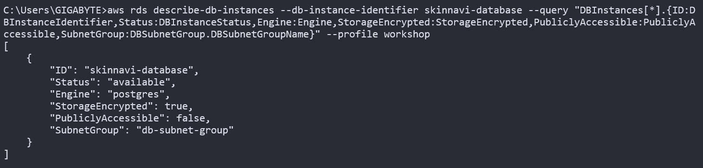
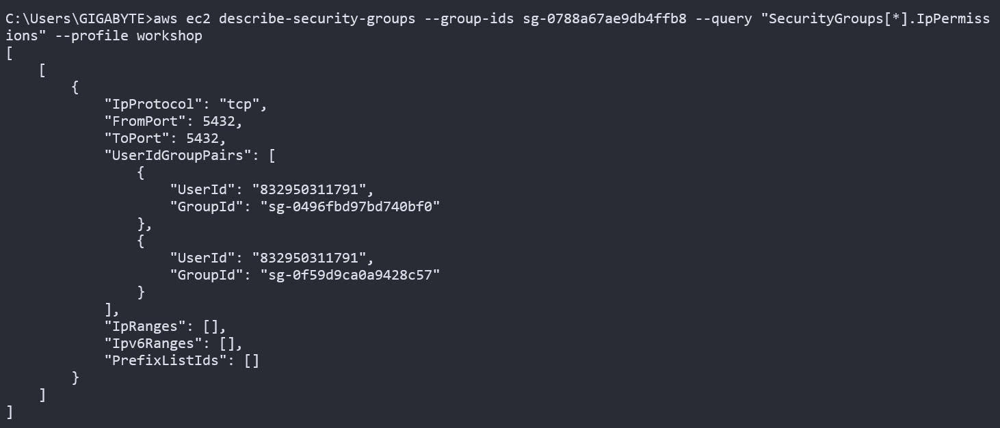
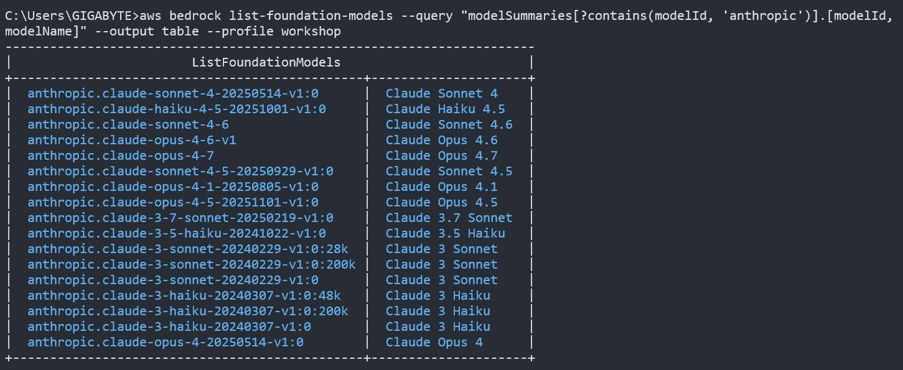
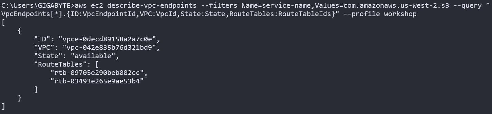
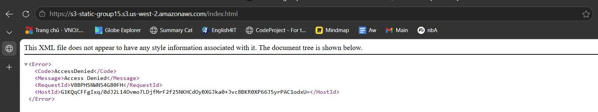
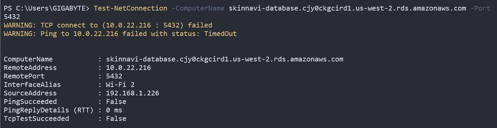

1. 🧾 COVER (Trang đầu)
# W3 Evidence Pack

## Group Information
- Group number: 15
- Members:
  - Phạm Vũ Khánh Trường
  - Ka Phu Đông
  - Nguyễn Thị Tiểu Phương
  - Văn Phú Tín 
  - Phan Văn Duy 
  - Hà Tây Nguyên 
  - Nguyễn Đình Thi
  - Trường Huy 
  - Nguyễn Thành Trung 

## Database Choice
- Selected DB engine: RDS Postgre SQL
- Reason: Nhóm em chọn PostgreSQL vì dữ liệu có nhiều quan hệ phức tạp và cần đảm bảo toàn vẹn dữ liệu + transaction ACID cho luồng thanh toán. Ngoài ra PostgreSQL cũng hỗ trợ tốt với Prisma nên triển khai thuận tiện và ổn định.

2. DATA ACCESS PATTERN LOG (A, B, C)

## Pattern A: [Tên pattern]
- Description: (ngắn gọn)
- Access type: Read / Write / Mixed
- Frequency: High / Medium / Low
- Chosen engine: (RDS / DynamoDB / etc.)
- Reason:
  - ...
  - ...

## Pattern B: ...

## Pattern C: ...

## Trade-offs
- Cost:
- Performance:
- Scalability:
- HA / Backup:

👉 Phần này quan trọng vì nó chứng minh bạn chọn database có lý do, không chọn bừa.

3. DEPLOYMENT EVIDENCE

## 3.1 Encryption
Screenshot: RDS
- 

- Explanation:
 + RDS PostgreSQL is successfully deployed and running.
 + Storage encryption is enabled using AWS KMS to secure data at rest.
 + Public access is disabled to prevent exposure to the internet.
 + Database is deployed inside a private subnet group for security isolation.

## 3.2 Backup
📸 Screenshot:
- [insert image]

📝 Explanation:
- Automated backup enabled with retention X days.

---

## 3.3 Security Group
- Screenshot:

- Explanation:
  + Database is only accessible from trusted application security groups.
  + Direct internet access is blocked for security.
  + This enforces network-level isolation between app and database tiers.

4. WORKING QUERY EVIDENCE
## Relational DB (RDS)
### Query: JOIN example
📸 Result:
- [image]

📝 Explanation:
- JOIN between table A and B using indexed key.

5. LAMBDA + BEDROCK
## Lambda Execution
📸 CloudWatch Log:
- Timestamp:
- Output:

📝 Explanation:
- Lambda triggered by event X

---

## Bedrock Foundation Models Access (Anthropic)
- Screenshot: 

- Explanation:
 + AWS Bedrock account has access to multiple Anthropic foundation models.
 + Models include different tiers:
   - Opus: highest reasoning capability (most powerful, highest cost)
   - Sonnet: balanced performance and cost
   - Haiku: optimized for speed and low cost
 + This confirms that Bedrock service is enabled and IAM permissions allow listing and using Anthropic models in region us-west-2.

6. VPC + NETWORKING
## Route Table (S3 Gateway Endpoint)
- Screenshot:

- Explanation:

## S3 Gateway VPC Endpoint
- Screenshot:

- Explanation:
 + Configured S3 Gateway VPC Endpoint inside the VPC.
 + Route tables are associated with the endpoint, enabling private routing to S3.
 + Traffic from EC2/Lambda to S3 does not traverse the public internet.
 + This improves security and reduces cost by eliminating NAT Gateway usage.

7. SECURITY TEST (DENIED ACCESS)
## S3 Public Access Test
- Screenshot:

- Explanation:
 + S3 bucket is not publicly accessible.
 + Block Public Access is enabled and prevents public reads.
 + This ensures static assets are protected and can only be accessed via authorized methods (e.g., CloudFront or IAM roles).

## RDS Connectivity Test from Public Network
- Screenshot: 

- Explanation:
 + RDS is deployed in a private subnet and not publicly accessible.
 + Security Group restricts inbound access to internal VPC resources only.
 + Connection attempt from external network (laptop public IP) is blocked as expected.
 + This confirms network-level isolation is correctly enforced.

8. BONUS (OPTIONAL)
## Before vs After
📸 Screenshot:
- Before:
- After:

## Metrics:
- Downtime:
- Latency improvement:

## Reflection:
- What changed and why it matters:
- Lessons learned: